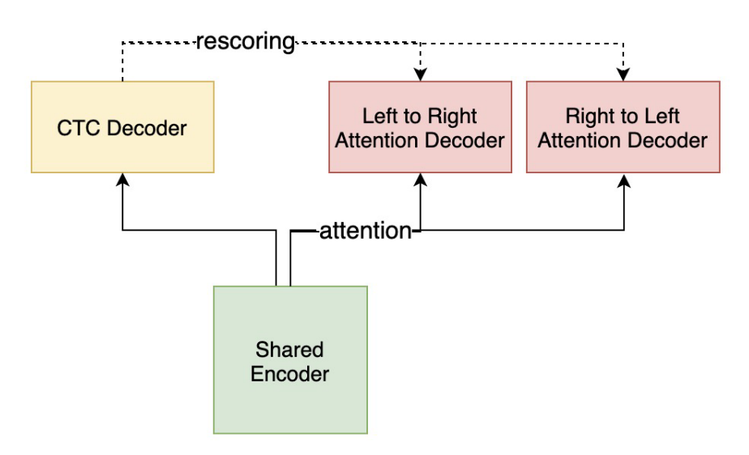

---
tasks:
- auto-speech-recognition
domain:
- audio
model-type:
- Non-autoregressive
frameworks:
- torch
backbone:
- transformer/conformer
metrics:
- CER
license: Apache License 2.0
language:
- cn
tags:
- WeNet
- WenetSpeech
widgets:
  - task: auto-speech-recognition
    inputs:
      - type: audio
        name: input
        title: 音频
    examples:
      - name: 1
        title: 示例1
        inputs:
          - name: input
            data: https://isv-data.oss-cn-hangzhou.aliyuncs.com/ics/MaaS/ASR/test_audio/asr_example.wav
    inferencespec:
      cpu: 8 #CPU数量
      memory: 4096
---

# U2++ Conformer 模型介绍

## 模型描述

WeNet 中采用的 U2 模型，如下图所示，该模型使用 Joint CTC/AED 的结构，训练时使用 CTC 和 Attention Loss 联合优化，并且通过 dynamic chunk 的训练技巧，使 Shared Encoder 能够处理任意大小的 chunk（即任意长度的语音片段）。


在解码的时候，先使用 CTC Decoder 产生得分最高的多个候选结果，再使用 Attention Decoder 对候选结果进行重打分 (Re-scoring)，并选择重打分后得分最高的结果作为最终识别结果。

解码时，当设定 chunk 为无限大的时候，模型需要拿到完整的一句话才能开始做解码，该模型适用于非流式场景，可以充分利用上下文信息获得最佳识别效果；当设定 chunk 为有限大小（如每 0.5 秒语音作为 1 个 chunk）时，Shared Encoder 可以进行增量式的前向运算，同时 CTC Decoder 的结果作为中间结果展示。

此时模型可以适用于流式场景，而在流式识别结束时，可利用低延时的 Re-scoring 算法修复结果，进一步提高最终的识别率。可以看到，依靠该结构，我们同时解决了流式问题和统一模型的问题。

U2++ 在原有 U2 的基础上，增加了新的 Right to Left Attention decoder。这个增加的 decoder 可以根据右侧信息（当前时刻之后的信息）来预测当前时刻。

因此增加的 left to right decoder 可以对右侧信息进行建模，U2 原有的 decoder 可以对左侧信息建模，那么二者结合起来就以达到对完整的序列进行双向建模的能力。



## 期望模型使用方式以及适用范围

### 如何使用

#### 代码范例

### 模型局限性以及可能的偏差

考虑到特征提取流程和工具以及训练工具差异，会对 CER 的数据带来一定的差异（<0.1%），推理 CPU、GPU 环境差异导致的 RTF 数值差异。

## 训练数据介绍

Wenetspeech 是西北工业大学音频语音和语言处理研究组(ASLP Lab)、出门问问、希尔贝壳联合发布的 10000 小时多领域中文语音识别数据集。

WenetSpeech 除了含有 10000+ 小时的高质量标注数据之外，还包括 2400+ 小时弱标注数据和 22400+ 小时的总音频。

覆盖各种互联网音视频、噪声背景条件、讲话方式，来源领域包括有声书、解说、纪录片、电视剧、访谈、新闻、朗读、演讲、综艺和其他等 10 大场景。

WenetSpeech 将开源中文语音识别训练数据规模提升到一个新的高度，是目前最大的开源多领域中文语音识别数据集。


## 模型训练流程

### 预处理

使用 Unified IO 的 `shard` 模式，将多个小数据（如 1000 条）的音频和标注打成压缩包 (tar)，并基于 Pytorch 的 IterableDataset 进行读取。


在训练的过程中，会在线提取 fbank 特征，并且做数据增广，无需预先提取特征。详情参考 [run.sh](https://github.com/wenet-e2e/wenet/blob/main/examples/wenetspeech/s0/run.sh)。


## 数据评估及结果

* 特征信息: 使用 fbank 特征, dither 1.0, 带 CMVN
* 训练参数: lr 0.001, batch size 48, 8 gpus on A100, acc_grad 16, 50 epochs
* 解码参数: ctc_weight 0.5, reverse_weight 0.3, average_num 10

| Decoding mode - Chunk size    | Dev (CER%)  | Test\_Net (CER%) | Test\_Meeting (CER%) |
|:-----------------------------:|:----:|:---------:|:-------------:|
| ctc greedy search - full      | 8.85 | 9.78      | 17.77         |
| ctc greedy search - 16        | 9.32 | 11.02     | 18.79         |
| ctc prefix beam search - full | 8.80 | 9.73      | 17.57         |
| ctc prefix beam search - 16   | 9.25 | 10.96     | 18.62         |
| attention rescoring - full    | 8.60 | 9.26      | 17.34         |
| attention rescoring - 16      | 8.87 | 10.22     | 18.11         |

### 相关论文以及引用信息

```BibTeX
@inproceedings{yao2021wenet,
  title={WeNet: Production oriented Streaming and Non-streaming End-to-End Speech Recognition Toolkit},
  author={Yao, Zhuoyuan and Wu, Di and Wang, Xiong and Zhang, Binbin and Yu, Fan and Yang, Chao and Peng, Zhendong and Chen, Xiaoyu and Xie, Lei and Lei, Xin},
  booktitle={Proc. Interspeech},
  year={2021},
  address={Brno, Czech Republic},
  organization={IEEE}
}

@article{zhang2021wenetspeech,
  author={Binbin Zhang and Hang Lv and Pengcheng Guo and Qijie Shao and Chao Yang and Lei Xie and Xin Xu and Hui Bu and Xiaoyu Chen and Chenchen Zeng and Di Wu and Zhendong Peng},
  title={WenetSpeech: {A} 10000+ Hours Multi-domain Mandarin Corpus for Speech Recognition},
  journal={arXiv preprint arXiv:2110.03370},
  year={2021}
}

@article{zhang2022wenet,
  title={WeNet 2.0: More Productive End-to-End Speech Recognition Toolkit},
  author={Zhang, Binbin and Wu, Di and Peng, Zhendong and Song, Xingchen and Yao, Zhuoyuan and Lv, Hang and Xie, Lei and Yang, Chao and Pan, Fuping and Niu, Jianwei},
  journal={arXiv preprint arXiv:2203.15455},
  year={2022}
}
```